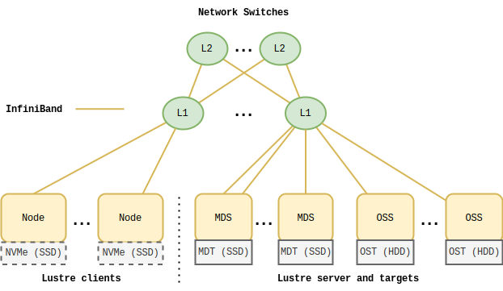

\newpage

# Puhti cluster at CSC
## Hardware configuration


Value | Metric | Value | IEC
- | - | - | -
$1$ | byte (B) | $1$ | byte (B)
$1000^1$ | kilobyte (kB) | $1024^1$ | kibibyte (KiB)
$1000^2$ | megabyte (MB) | $1024^2$ | mebibyte (MiB)
$1000^3$ | gigabyte (GB) | $1024^3$ | gibibyte (GiB)
$1000^4$ | terabyte (TB) | $1024^4$ | tebibyte (TiB)
$1000^5$ | petabyte (PB) | $1024^5$ | pebibyte (PiB)

: Units for bytes in base $10$ and $2$.
One byte is a string of $8$ bits.

Node category | Node type | Node count | Memory \newline (GiB per node) | Local storage \newline (GiB per node)
-|-|-|-|-
service | Utility | 5 | 384 | 2900
service | Utility-FMI | 2 | 384 | 2900
service | AeroS MDS | 2 |   |  
service | AeroS OSS | 4 |   |  
service | ISMA | 4 |   |  
service | Data Lake | 8 |   |  
compute | CPU, M | 484 | 192 | -
compute | CPU, M, IO | 48 | 192 | 1490
compute | CPU, M-FMI | 240 | 192 | -
compute | CPU, L | 92 | 384 | -
compute | CPU, L, IO | 40 | 384 | 3600
compute | CPU, XL | 12 | 768 | 1490
compute | CPU, BM | 6 | 1500 | 5960
compute | GPU | 80 | 384 | 3600

: Nodes on Puhti \label{tab:compute-nodes}

The *Puhti* cluster has 23 *service nodes* and 1002 *compute nodes*.
The services nodes consist of utility nodes used as cluster's *login nodes*, MDS nodes and OSS nodes for the Lustre file system, ISMA nodes used for managing the cluster and Data Lake nodes for [interfacing with object storage services?].
The compute nodes consist of 922 *CPU nodes* and 80 *GPU nodes*.
Each login and compute node consists of 2 $\times$ *Intel Xeon Gold 6230* CPUs with 20 cores and 2.1 GHz base frequency.
In addition to CPUs, each GPU node has 4 $\times$ *Nvidia Volta V100* GPUs and each GPU has 36 GiB of GPU memory.
We give compute nodes types based on how much memory (RAM) and *fast local storage* they contain, and whether they contains GPUs.
Fast local storage is a Solid State Disk (SSD) attached to the node via *Non-Volative Memory Express (NVMe)* to perform I/O intensive processes instead of having to rely on the global storage from the Lustre file system.

The nodes are connected using *Mellanox HDR InfiniBand* (100 GB/s IB HDR100) to L1 switches which are connected to L2 switches in a *fat-tree* network topology.
The network has a total of 28 L1 switches and 12 L2 switches.
The InfiniBand cabling has 1:1 pruning for GPU nodes and 2:1 for other nodes.

The global storage on Puhti consists of a Lustre file system (version 2.12.6) from *DataDirect Networks (DDN)* that has 2 MDSs and 8 virtualized OSSs with ES18K controller.
Each MDS has 2 MDTs on each server connected to 20 $\times$ 800 GB NVMe.
Each OSS has 3 OSTs on each server connected to 704 $\times$ 10 TB SAS HDD.
The total storage capacity of the file system is 4.8 PBs since part of the total capacity is reserved for redundancy.


## System configuration
Puhti uses the *RedHat Enterprise Linux Server* as its operating system.
The version transitioned from 7.9 to 8.6 during the thesis writing.
Each node in Puhti has a *hostname* in the form `<nodename>.bullx`.
The format of the *node name* string using *Perl Compatible Regular Expression* (PCRE) syntax is **`puhti-[[:alnum:]]`** for utility nodes and **`r[0-9]{2}{c,m,g}[0-9]{2}`** for compute nodes.
For example, `puhti-login12.bullx` or `r01c01.bullx`.
We can use node names to track file system operations in node specific level.

In CSC systems, users have a *user account* which can belong to one or more *projects*.
Projects are used for setting quotas and accounting of computational resources and storage.
The usage of computational resources is measured using *Billing Units (BU)*.
Different rates of billing unit usage are set to resources including reserved CPU cores, memory, local disk, and GPUs.
[@cscdocs]

In Puhti, each user account is associated with a *user* and each project with a *group*.
We can use user IDs (UID) and group IDs (GID) as identifiers for measuring file system usage in user or group level.
We should note that, UIDs from 0 to 999 to are reserved for system processes.
For example, 0 is root and 666 is job control.
It is useful to separate the file system operations performed by system UIDs from the other UIDS.

File system is separated to *storage areas*.
Each storage area has a dedicated directory.
The global, Lustre file system is shared across *home*, *projappl*, and *scratch* storage areas with different uses and quotas.

*home*
: area is intended for storing personal data and configuration files.
In the file system, it resides at `/home/<user>` available via the `$HOME` variable and has a default quota of 10 GB per user.

*projappl*
: area is intended for storing project-specific application files such as compiled libraries.
It resides at `/projappl/<project>` and has a default quota of 50 GB per project.

*scratch*
: area is intended for short-term storage (90 days) of data used in the cluster.
It resides at `/scratch/<project>` and has a default quota of 1 TB per project.
Files that require long-term storage should be moved to a long-term data storage outside Puhti.

Jobs should use the *scratch* area for storing data.
They should access *home* or *projappl* areas only to read or copy configuration files or application specific files in the beginning of the job.

The fast local storage, mounted on a local SSD, is called *tmp* or *local scratch*.
It is intended as temporary file storage for I/O heavy operations.
User should copy data that they wish to keep after the job has completed to *scratch* since files in these temporary storage areas are cleaned regularly.

*tmp*
: is an area for login and interactive jobs to perform I/O heavy operations such as post and preprocessing of data, compiling libraries, or compressing data.
It resides at `/local_scratch/<user>` available via the `$TMPDIR` variable.

*local scratch*
: is an area for batch jobs to perform I/O heavy operations.
The quota depends on how much is requested for the job.
It resides at `/run/nvme/job_<jobid>/data` available via the `$LOCAL_SCRATCH` variable.


## Running workloads
partition name | time limit | task limit | node limit | node type
-|-|-|-|-|-|-
*test* | 15 minutes | 80 | 2 | M
*interactive* | 7 days | 8 | 1 | IO
*small* | 3 days |  40 | 1 | M, L, IO
*large* | 3 days | 1040 | 26 | M, L, IO
*longrun* | 14 days | 40 | 1 | M, L, IO
*hugemem* | 3 days | 160 | 4 | XL, BM
*hugemem\_longrun* | 14 days | 40 | 1 | XL, BM
*fmitest* | 1 hour | 80 | 2 | M-FMI
*fmi* | 12 days | 4000 | 100 | M-FMI
*gputest* | 15 minutes | 8 | 2 | GPU
*gpu* | 3 days | 80 | 20 | GPU

: Slurm partitions on Puhti \label{tab:slurm-partitions}

Puhti uses Slurm version 21.08.7 and partitions with different resource limits as seen on table \ref{tab:slurm-partitions}.
When we submit a job to Slurm, we must specify in which partition it will run, the project which used for billing, and the resource we wish to reserve.
Slurm schedules the job to run when sufficient resource are available.
It sets different job specific environment variables for each job such that programs can access and use the job information within the process.
Later, we will use the `SLURM_JOB_ID` as identifier to collect job specific file operations.
Slurm also performs accounting of other details about the submitted jobs.

We can submit a job to the Slurm scheduler as a shell script via the `sbatch` command.
We can specify the options as command line arguments as we invoke the command or in the script as comments.
The script specifies job steps using the `srun` command.
Next, we explain some common types of jobs.

---

Small sequential batch job with a single job step.

```sh
#!/usr/bin/env bash
#SBATCH --job-name=<job-name>
#SBATCH --account=<project>
#SBATCH --partition=small
#SBATCH --time=01:00:00
#SBATCH --nodes=1
#SBATCH --tasks-per-node=1
#SBATCH --cpus-per-task=1
#SBATCH --mem-per-cpu=10G
srun <program>
```

Array job runs multiple similar, independent jobs

```sh
#SBATCH --array=1-100
srun <program> $SLURM_ARRAY_TASK_ID
```

---

Large parallel batch job with four job steps.

```sh
#!/usr/bin/env bash
#SBATCH --job-name=<job-name>
#SBATCH --account=<project>
#SBATCH --partition=large
#SBATCH --time=02:00:00
#SBATCH --nodes=2
#SBATCH --tasks-per-node=2
#SBATCH --cpus-per-task=20
#SBATCH --mem-per-cpu=2G
#SBATCH --gres=nvme:100
# 1. job step
srun --nodes 2 --ntasks 1 <program-1>
# 2. job step
srun <program-2>
# 3. job step
srun --nodes 1 --ntasks 2 <program-3> &
# 4. job step
srun --nodes 1 --ntasks 2 <program-4> &
# Wait for job 2. and 3. to complete
wait
```

---

In the above example, the first program will run on the first job step and would load data to the local disk.

The second program will run on the second job step utilizing all given nodes, tasks, and cpus and the majority of the given time.
The program is some large parallel program such as a large, well parallelizing simulation.

The third and fourth programs job steps will run in parallel after the first step, both utilizing all tasks and cpus from a single node.
These programs could be, for example, programs for post processing steps, for example, processing and backing up the simulation results.


