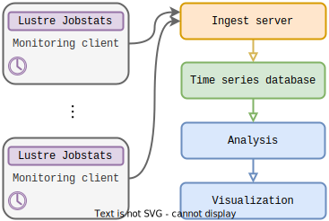

\newpage

# Monitoring system
## Overview



We built the monitoring system using the client-server architecture as seen in Figure \ref{fig:monitoring-system}.
On each Lustre server, a monitoring client collects the usage statistics at regular intervals and sends them to the ingest server.
The ingest server processes the data from the monitoring clients and inserts it into the time series database.
Then, we can perform queries on the database or dump data from it and analyze it outside the database.
Ideally, we would like to perform continuous analytics on the database as new data arrives, but we leave it for future development.

We experienced some problems during the development.
For example, we had a problem directly related to the issues with entry identifiers, covered in Section \ref{issues-with-entry-identifiers}, 
Because we assumed that all nodenames would follow the short hostname format, we accidentally parsed the entry identifiers with a short hostname and a fully-qualified hostname as the same.
The mistake led us to identify two different time series as the same, resulting in wrong values when analyzing the statistics.
We patch-fixed it by modifying our parser to disambiguate between the two formats.
However, we lost a fair amount of time and data due to this problem.

The next problem was related to how we computed rates from counter values, which we describe in Section \ref{analyzing-statistics}.
Initially, we computed the difference between two counters online in the monitoring clients and stored them in the database.
This approach made database queries easier since we used a constant interval, so the differences are proportional to the rates.
However, we discovered that if a message from the monitoring client to the ingest server is lost, we cannot interpolate the missing value, and the information is lost.
Also, the program design is much more complicated if we compute the rates on the monitoring clients.

To solve these problems, we switched to collecting the raw values in the database and computing the rates after we inserted the data.
This approach simplifies the monitoring system, and we can easily interpolate the values for missing intervals.
We can also use a variable interval length if we need.

As an author's note, my advisor was responsible for programming and installing these programs.
We adapted the program code from a GPU monitoring program written in the Go language using InfluxDB [@influxdb] as a database.
We take the precise design of programs as given and explain them only at a high level.


## Storing time series data
Field | Type | Value
----|----|----------
`time_series_id` | UUID | Identifier for an individual time series.
`timestamp` | Datetime with timezone | Timestamp with UTC timezone.
`<field>` | Data type | One or more observed values.

: \label{tab:schema-time-series}
  Each *record of time series data* consists of an time series identifier and timestamp with one or more values of the observations and is.


Field | Type | Value
----|----|----------
`time_series_id` | UUID | Identifier for an individual time series.
`<field>` | Data type | One or more metadata values related to the time series identifier.

: \label{tab:schema-metadata}
  Each *record of metadata* consists of the times series identifier and one or more metadata values.


We can use a *time series database* to efficiently store and handle time series data from multiple distinct time series.
*Time series data* has distinctive properties that allow optimizations for storing and querying them.
TimescaleDB documentation [@docs-timescale] characterizes these properties as:

1) *time-centric* meaning that records always have a timestamp.
2) *append-only* meaning that we almost always append new records and rarely update existing data or backfill missing data about old intervals.
3) *recent* new data is typically about recent time intervals.

There are different options for choosing a time series databases.
One key differentiation between time series databases is whether they are built to handle fixed or growing amount of distinct time series.
Since we handle data that has a growing number of distinct time series we chose *TimescaleDB*.
TimescaleDB expands PostgreSQL for storing and analyzing time series data and can scale well to an increasing amount of distict time series without its performance suffering drastically.
Initially, we used *InfluxDB*, but found out that it did not scale well for our use case.

An instance of time series database consist of one or more *time series tables* with schema as in Table \ref{tab:schema-time-series} and optional *metadata table* with schema as in Table \ref{tab:schema-metadata}.
A separate metadata table reduces data bloat and makes it easier to alter its schema later.
We can join the metadata table and time series table during queries.

For the *time series identifier* (`time_series_id`), we can use a *Universally Unique Identifier (UUID)* which has the benefit of being standardized and has explicit support for namespaces.

For the *timestamp* (`timestamp`), we use datetime with *Coordinated Universal Time (UTC)* timezone instead of local timezones to avoid problems with daylight saving time.
We recommend datetime instead of Unix epoch, because datetimes are human readable.

The time series table is a *TimescaleDB hypertable* with *indices* for efficient queries, *chunked* by a chosen time interval for improved performance, a *compression policy* to compress data that is older than specified time to reduce storage, and a *retention policy* for dropping data that is older than specified time to limit data accumulation or for privacy and regulatory reasons.
The metadata table is regular PostgreSQL table.

In our implementation, we stored everything on a single table.
In future implementations, we should use a separate metadata table and time series tables for MDT and OST data since they mainly contain different fields.
Also, we could combine the metadata infromation with Slurm job information.


## Monitoring client
TODO: parsing with Regex

The monitoring client calls the appropriate command (`lctl get_param`) as explained in Section \ref{operations-and-statistics}, at regular observation intervals to collect statistics.
In the description that we present here, we used the the time at which the call was made as the timestamp and store the snapshot time as value similar to the statistics.
In practise, our first version used the call time and second version used the snapshot time as timestamp.
The downside of using snapshot time as timestamp is that we lose some information about periods where the job does not perform any operations.

The observation interval should be less than half of the cleanup interval for reliable reset detection.
Smaller observation interval increases the resolution but also increase the rate of data accumulation.
We used a 2-minute observation interval and 10-minute cleanup interval.

Monitoring client parses the target and all entries from the output.
For all entries, it creates a data structure with the timestamp, target, and parsed entry identifier, snapshot time and statistics listed on Table \ref{tab:operations}.
An example instance of a data structure using *JavaScript Object Notation (JSON)* looks as follows:

```json
{
  "target": "scratch-OST0001",
  "entry_id": "11317854:17627127:r01c01",
  "timestamp": "2022-11-21T06:02:00.000+00:00",
  "snapshot_time": 1669010520,
  "read": 7754,
  "write": 4284,
  "...": "..."
}
```

The monitoring client must also keep track of previously observed identifiers, concatenation of target and entry identifier (`<target>:<entry_id>`), and the previous observation timestamp.
If we encounter an identifier that was not present in the previous observation interval, we must create a new instance of an data structure with the new target and entry identifier, the previous timestamp, missing value for snapshot time and zeros for statistics to mark the beginning of time series.
It will be *backfilled* to the database.
For example, if the previous data structure is the first observation, we have:

```json
{
  "target": "scratch-OST0001",
  "entry_id": "11317854:17627127:r01c01",
  "timestamp": "2022-11-21T06:00:00.000+00:00",
  "snapshot_time": null,
  "read": 0,
  "write": 0,
  "...": "..."
}
```

Finally, the monitoring client composes a message of the data by listing the individual data structures in a JSON array and sends it to the ingest server via *Hypertext Transfer Protocol (HTTP)*.
Our implementation actually used the *InfluxDB line protocol* for communication because we designed the code initially for InfluxDB.
Due to the scaling problem, we switched to TimescaleDB and suggest using JSON for communication instead.


## Ingest server
The ingest server is responsible for maintaining a connection to the database and listening to the messages from the monitoring clients, parsing them and inserts the data to the database.

In our implementation we did not use a time series identifier.
Instead we identified different time series as distict tuples of target, nodename, job ID, and user ID.
For login nodes, which do not have a job ID, we generated synthetic job ID using the executable name and user ID values.
We also parsed the values on the monitoring clients, rather than in the ingest server.
However, a time series identifier is easier to use in database queries, reduces ambiguity about how to identify an individual time series and allows separating the metadata and time series data.

For future implementations we should use a time series identifier.
We can generate the time series identifier as UUID from the concatenated string of target and entry identifier (`<target>:<entry_id>`) with a randomly generated UUID as *namespace* associated with the formatting of the target and entry identifier strings.
If the formatting changes, we should change the namespace to avoid collision with time series identifiers.
If the namespace is kept secret, the UUID also anonymizes the metadata values associated with time series data.
For example, we can generate a namespace as follows:

```sh
uuidgen --random
```

```
2e79b8a1-c4fc-45ba-9023-d16fdce6e3fe
```

Then, we can generate the time series identifier using the namespace and concatenated string of target and entry identifier.

```sh
uuidgen --sha1 \
    --namespace="2e79b8a1-c4fc-45ba-9023-d16fdce6e3fe" \
    --name="scratch-OST0001:11317854:17627127:r01c01"
```

```
af854063-c381-585f-b551-ce0b6c4440a3
```

Now, we can separate the ingested data into *time series structure* and *metadata structure*.
We should append the time series structure to the appropriate time series table.

```json
{
  "time_series_id": "af854063-c381-585f-b551-ce0b6c4440a3",
  "timestamp": "2022-11-21T06:02:00.000+00:00",
  "snapshot_time": 1669010520,
  "read": 7754,
  "write": 4284,
  "...": "..."
}
```

Metadata structure contains the parsed metadata fields or null if the value is missing.
We need to parse and update metadata only if it does not already exists in the metadata table.

```json
{
  "time_series_id": "af854063-c381-585f-b551-ce0b6c4440a3",
  "target": "scratch-OST0001",
  "entry_id": "11317854:17627127:r01c01",
  "job_id": 11317854,
  "user_id": 17627127,
  "nodename": "r01c01",
  "executable": null
}
```

We can convert these structures into appropriate insert statements and send them to the database with columns named similarly as in the structures.

