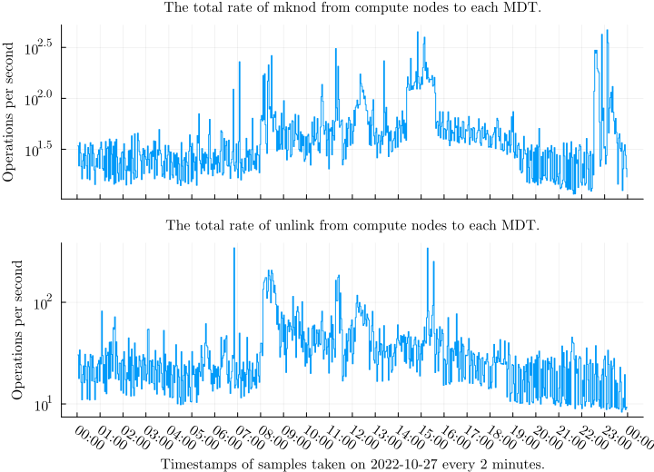
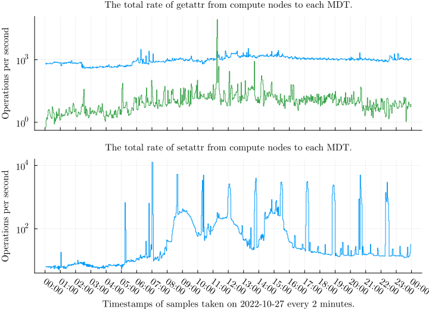

\clearpage

# Results
The results section discusses the issues we found with the data quality from Lustre Jobstats on Puhti.
Then, we show observations from the data that we believe to be reliable.
As a consequence of the issues, the analysis is less deep and automated than was the initial goal.

The volume and complexity of data make representation a challenge.
We attempt to pick a visualization that best represents interesting features from the data.

TODO: outline, Section ...

TODO: mention bug report about broken jobids [@jobid-atomic]

\clearpage

## Entries and issues

Format | Observed entry identifier
-|-
Correct | `wget.11317854`
Correct | `11317854:17627127:r01c01`
Missing job ID | `:17627127:r01c01`
Malformed | `wget`
Malformed | `wget.`
Malformed | `11317854`
Malformed | `11317854:`
Malformed | `113178544`
Malformed | `11317854:17627127`
Malformed | `11317854:17627127:`
Malformed | `11317854:17627127:r01c01.bullx`
Malformed | `:17627127:r01c01.bullx`
Malformed | `:1317854:17627127:r01c01`

: \label{tab:jobid-examples}
Examples of various observed entry identifiers.
The examples show correct entry identifiers, identifiers with missing job IDs, and various malformed identifiers.

We found that some of the observed entry identifiers did not conform to the format on the settings described in Section \ref{entry-identifier-format}.
Table \ref{tab:jobid-examples} demonstrates some of the entry identifiers we observed.

The first issue is missing Job ID values.
A non-system user ID that runs a job on compute nodes has a Slurm Job ID set; thus, the identifier should include it.
However, we found that there were entries where they were systematically missing.
Due to these issues, data from the same job might scatter into multiple time series without reliable indicators making it impossible to provide reliable statistics for specific identifiers.
The issue might be related to problems fetching the environment variable's value.
This issue occurred in both MDSs and OSSs on Puhti.

The second issue is that there were malformed entry identifiers.
The issue is likely related to the lack of thread safety in the functions that produce the entry identifier strings in the Lustre Jobstats code base.
Consequently, we cannot reliably parse information from these entry identifiers, and we had to discard them, which resulted in data loss.
This issue occurred only in OSSs on Puhti.
We obtained feasible values for correct entry identifiers, but we are still determining if the reliability of the counter values is affected by this issue.

The Figures \ref{fig:entry-ids-mds-user}, \ref{fig:entry-ids-mds-system}, \ref{fig:entry-ids-oss-user}, and \ref{fig:entry-ids-oss-system} show the counts of various observed entry identifiers in a sample of 113 consecutive 2-minute intervals separated by Lustre server, user ID category (system versus non-system) and entry identifier formatting.

The number of entry identifiers with missing job IDs is substantial compared to the number of correct identifiers.
We also observe that Jobstats systemically generates malformed identifiers on the OSSs.
In some conditions, it can create many of them.
Apart from the previously mentioned issues, we see a lot of entries with system user IDs.
These entries add much valuable information and thus increase data bloat.
We should either filter them or find ways to combine them into fewer entries.

\clearpage

## Counters and rates
This section shows examples of the sampled counter values and rates computed from the counters.
We refer to operations from a Lustre client (node) to a Lustre target as a *connection*.
Figures \ref{fig:job-rate-1}, \ref{fig:job-rate-2}, and \ref{fig:job-rate-3} show different patterns of counter values and the computed rates for write operations for 24 hour-period of 2022-10-27. 
Each line displays the values for a connection from a compute node to an OST for the same job.
The x-axis displays time, and the y-axis display the accumulated amount of operations for counters and the operations per second for the rate.

\clearpage

## Total rates
This section shows the total rates from all compute nodes to each target for each measured operation, listed in Table \ref{tab:operations}.
We show the total rates during 24 hours of 2022-10-27 for MDTs in Figures \ref{fig:total-mdt-1}, \ref{fig:total-mdt-2} and \ref{fig:total-mdt-3}, and for OSTs in Figures \ref{fig:total-ost-1} and \ref{fig:total-ost-2}.
The MDT figures show that only one or two of four MDTs are usually actively handling operations.
On the contrary, all 24 OSTs handle operations.
The interesting features in the figures are the variation of rates across time and between targets.
For example, significant differences between the rates of two OSTs indicate an unbalanced load.
A problematic I/O pattern or insufficient file striping might cause the imbalance.
File striping means Lustre segments the file data into multiple OSTs instead of storing all the data in a single OST.
Please note that we use a logarithmic scale due to large variations in the magnitude of the rates.

\clearpage

## Density of multiple rates
![This graph shows read operations on OST0001 during 24 hours of 2022-10-27.
The first subplot shows the time series of the total rate, the second subplot shows the time series of the total rate of each user ID, and the third subplot shows the density of the total rates of each user ID.
We can see that individual users cause spikes in the read rates.
The base load mostly stays the same, although a few more users perform read operations from around 7.00 to 17.00 UTC, corresponding to daytime in Finland (10.00 to 20.00).
We can perform a similar analysis based on job ID or node name.
\label{fig:density}](figures/2022-10-27_ost0001_compute_read.svg)

We can use a density plot to extract meaningful information from large numbers of time series visually.
A heatmap consists of time in the x-axis, discrete bins in the y-axis, and color in the z-axis, indicating how many time series have the value at the bin's range at that time.
We also use a logarithmic scale for the density due to the large variations.
As shown in Figure \ref{fig:density}, apart from the individual spikes, obtaining information from a graph with many time series is challenging as they tend to overlap.
The density is a statistical plot that shows how many time series have a value in a specific range at a particular time. 
However, it omits information about individual time series.
It lets us distinguish whether a small number of users perform a large magnitude of operations or a large number of users perform a small magnitude of operations.
We can also use it to obtain information such as time intervals and value ranges to filter the data further.
An important question is whether we could obtain such information automatically.

