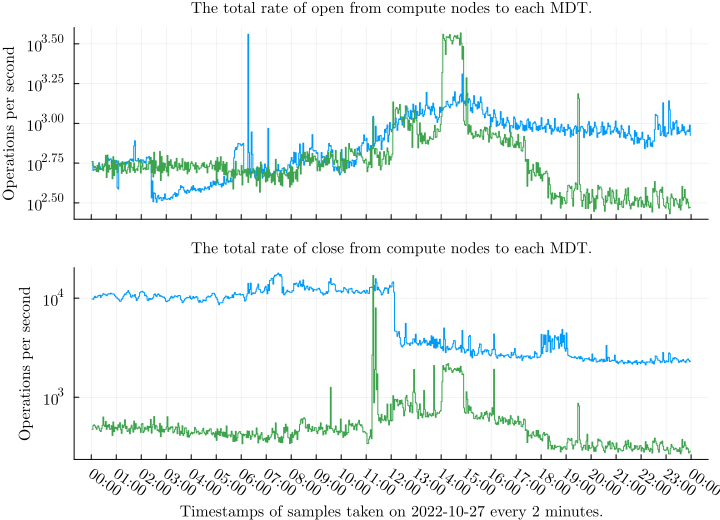

\newpage

# Results
## Overview
TODO: add description and explanation here

The sheer volume and complexity of data makes representation challenging.
We attempt to pick visualization that best represent interesting features from the data.

\clearpage

## Entries and issues

Type | Entry identifier | Notes
-|-----|-----
0 |`11317854:17627127:r01c01` | Correct format
1|`:17627127:r01c01` | Job ID missing
2|`11317854` | job ID field without separator
2|`11317854:` | job ID field with separator
2|`113178544` | job ID field with separator at the end is overwritten by a digit
2|`11317854:17627127` | job ID and user ID fields
2|`11317854:17627127:` | job ID and uid ID fields ending with a separator
2|`11317854:17627127:r01c01.bullx` | fully-qualified hostname instead of a short hostname
2|`:17627127:r01c01.bullx` | job ID field is missing and fully qualified hostname instead of a short hostname
2|`:1317854:17627127:r01c01` | the first character in job ID overwritten by separator
2|...| There were many more ways the identifier was broken.

: \label{tab:jobid-examples}
Examples of various observed entry identifiers on compute nodes.
We refer to colon (`:`) as *separator*.

This section discusses the issues we found with the data quality from Lustre Jobstats on Puhti.
We found out that some of the observed entry identifiers did not conform to the format on the settings described in Section \ref{entry-identifier-format}.

The first type of issue is missing Job ID values in some entries from normal user in compute nodes even thought the Slurm job identifier is set.
It might be related to some issues in fetching the value of the environment variable.
This issues occured in both MDSs and OSSs.

The second type of issue is that some entry identifiers were malformed.
We cannot reliably parse Job ID, User ID, and Nodename information from these entry identifiers.
This issue occured only in OSSs.
We believe that this issue is related to lack of thread-safety in some of the functions that produce the entry identifier strings.

As a consequence of these issues, data from the same job might be scattered into multiple time series without reliable indicators making it impossible to provide reliable statistics for specific identifiers.
As we cannot use these entries in the analysis, we have to discard them and we lose some data.
The reliability of the counter data does not seem to be affected by this issue.

Table \ref{tab:jobid-examples} demonstrates some of the entry identifiers we found.

The Figure \ref{fig:entry-ids-mds-user}, \ref{fig:entry-ids-mds-system}, \ref{fig:entry-ids-oss-user}, and \ref{fig:entry-ids-oss-system} show the counts of different entry identifiers in a sample of 113 consecutive 2-minute intervals from all MDSs and OSSs.

<!-- In the tables, dash *-* indicates missing value, *system* is User ID reserved for ssystem processes, *user* is User ID reverved for user processes, *slurm* is Slurm Job ID, *login* is login Nodename, *compute* is compute Nodename, *utility* is utility Nodename and *compute (q)* is fully-qualified hostname for compute node. -->

Apart from the broken identifiers, we see lot of entries for with system user ID.
These entries increase data bloat and generally don't add that much useful information.
\clearpage

## Counters and rates
This section shows examples of the sampled counter values and rates computed from the counters.
We refer to operations from a Lustre client (node) to a Lustre target as a *connection*.
Figures \ref{fig:job-rate-1}, \ref{fig:job-rate-2}, and \ref{fig:job-rate-3} show different patterns of counter values and the computed rates for write operations for 24 hour-period of 2022-10-27. 
Each line displays the values for a connection from a compute node to an OST for the same job.
The x-axis displays time, and the y-axis displays the accumulated amount of operations for counters and the operations per second for the rate.

\clearpage

## Total rates
This section shows the total rates from all compute nodes to each target for each measured operation, listed in Table \ref{tab:operations}.
We show the total rates during 24 hours of 2022-10-27 for MDTs in Figures \ref{fig:total-mdt-1}, \ref{fig:total-mdt-2} and \ref{fig:total-mdt-3}, and for OSTs in Figures \ref{fig:total-ost-1} and \ref{fig:total-ost-2}.
The MDT figures show that only one or two of four MDTs are usually actively handling operations.
On the contrary, all 24 OSTs handle operations.
The interesting features in the figures are the variation of rates across time and between targets.
For example, significant differences between the rates of two OSTs indicate that the load is not balanced.
A problematic I/O pattern or insufficient file striping might cause the imbalance.
File striping means Lustre segments the file data into multiple OSTs instead of storing all the data in a single OST.
Please note that we use a logarithmic scale due to large variations in the magnitude of the rates.

\clearpage

## Density of multiple rates
![This graph shows read operations on OST0001 during 24 hours of 2022-10-27.
The first subplot shows the time series of the total rate, the second subplot shows the time series of the total rate of each user ID, and the third subplot shows the density of the total rates of each user ID.
We can see that individual users cause spikes in the read rates.
The base load mostly stays the same, although a few more users perform read operations from around 7.00 to 17.00 UTC, which corresponds to daytime in Finland (10.00 to 20.00).
We can perform a similar analysis based on job ID or node name.
\label{fig:density}](figures/2022-10-27_ost0001_compute_read.svg)

We can use a density plot to extract meaningful information from large numbers of time series visually.
A heatmap consists of time in the x-axis, discrete bins in the y-axis, and color in the z-axis, indicating how many time series have the value at the bin's range at that time.
We also use a logarithmic scale for the density due to the large variations.
As shown in Figure \ref{fig:density}, apart from the individual spikes, it is difficult to obtain information from a graph with many time series as they tend to overlap.
The density is a statistical plot that shows how many time series have a value in a specific range at a particular time. 
However, it omits information about individual time series.
It lets us distinguish whether a small number of users perform a large magnitude of operations or a large number of users perform a small magnitude of operations.
We can also use it to obtain information such as time intervals and value ranges to filter the data further.
An important question is whether we could obtain such information automatically.

