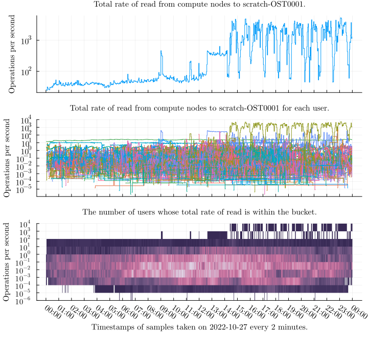

\newpage

# Results
## Overview
\textcolor{red}{
TODO: add plots and explanation here
}

The sheer volume and complexity of data makes representation challenging.
We attempt to pick visualization that best represent interesting features from the data.

## Issues with entry identifiers

Type | Entry identifier | Notes
-|-----|-----
0 |`11317854:17627127:r01c01` | Correct format
1|`:17627127:r01c01` | Job ID missing
2|`11317854` | job ID field without separator
2|`11317854:` | job ID field with separator
2|`113178544` | job ID field with separator at the end is overwritten by a digit
2|`11317854:17627127` | job ID and user ID fields
2|`11317854:17627127:` | job ID and uid ID fields ending with a separator
2|`11317854:17627127:r01c01.bullx` | fully-qualified hostname instead of a short hostname
2|`:17627127:r01c01.bullx` | job ID field is missing and fully qualified hostname instead of a short hostname
2|`:1317854:17627127:r01c01` | the first character in job ID overwritten by separator
2|...| There were many more ways the identifier was broken.

: \label{tab:jobid-examples}
Examples of various observed entry identifiers on compute nodes.
We refer to colon (`:`) as *separator*.

Unfortunately, we found two separate issues with the entry identifiers on the Puhti system.
That is, did not conform to the format described in Section \ref{entry-identifier-format}.

The first type of issue is missing Job ID values in some entries from normal user in compute nodes even thought the Slurm job identifier is set.
It might be related to some issues in fetching the value of the environment variable.
This issues occured in both MDSs and OSSs.

The second type of issue is that some entry identifiers were malformed.
We cannot reliably parse Job ID, User ID, and Nodename information from these entry identifiers.
This issue occured only in OSSs.
We believe that this issue is related to lack of thread-safety in some of the functions that produce the entry identifier strings.

As a consequence of these issues, data from the same job might be scattered into multiple time series without reliable indicators making it impossible to provide reliable statistics for specific identifiers.
As we cannot use these entries in the analysis, we have to discard them and we lose some data.
The reliability of the counter data does not seem to be affected by this issue.

Table \ref{tab:jobid-examples} demonstrates some of the entry identifiers we found.

Job ID | User ID | Nodename | Count | Ratio
:-:|:-:|:-:|-:|-:|-:|-:
slurm|user|compute|145590|63.93
-|user|compute|21037|9.24
-|user|login|55077|24.19
-|user|utility|6012|2.64
||||227716

: \label{tab:jobids-mds-user}
MDS, user

Job ID | User ID | Nodename | Count | Ratio
:-:|:-:|:-:|-:|-:|-:|-:
slurm|system|compute|36909|28.98
-|system|compute|84275|66.17
-|system|login|6132|4.81
-|system|utility|45|0.04
||||127361

: \label{tab:jobids-mds-system}
MDS system

Job ID | User ID | Nodename | Count | Ratio
:-:|:-:|:-:|-:|-:|-:|-:
slurm|user|compute|1126289|69.88
-|user|compute|187101|11.61
-|user|login|271561|16.85
-|user|utility|9674|0.60
slurm|user|compute (q)|2655|0.16
-|user|compute (q)|43|<0.01
slurm|user|-|4769|0.30
slurm|-|-|6928|0.43
-|user|-|67|<0.01
-|-|-|2766|0.17
||||1611853

: \label{tab:jobids-oss-user}
OSS, user

Job ID | User ID | Nodename | Count | Ratio
:-:|:-:|:-:|-:|-:|-:|-:
slurm|system|compute|2003|0.32
-|system|compute|610189|97.70
-|system|login|10074|1.61
-|system|utility|1519|0.24
slurm|system|compute (q)|0|0
-|system|compute (q)|237|0.04
slurm|system|-|0|0
slurm|-|-|0|0
-|system|-|540|0.09
-|-|-|0|0
||||624562|

: \label{tab:jobids-oss-system}
OSS system

The Tables \ref{tab:jobids-mds-user}, \ref{tab:jobids-mds-system}, \ref{tab:jobids-oss-user}, and \ref{tab:jobids-oss-system} show the counts of different entry identifiers in a sample of 113 consecutive 2-minute intervals from all MDSs and OSSs.
In the tables, dash *-* indicates missing value, *system* is User ID reserved for ssystem processes, *user* is User ID reverved for user processes, *slurm* is Slurm Job ID, *login* is login Nodename, *compute* is compute Nodename, *utility* is utility Nodename and *compute (q)* is fully-qualified hostname for compute node.

Apart from the broken identifiers, we see lot of entries for with system user ID.
These entries increase data bloat and generally don't add that much useful information.

## Rates of a job
TODO:

## Total rates of all targets per operation

## Total rate and densities of aggregates per target

