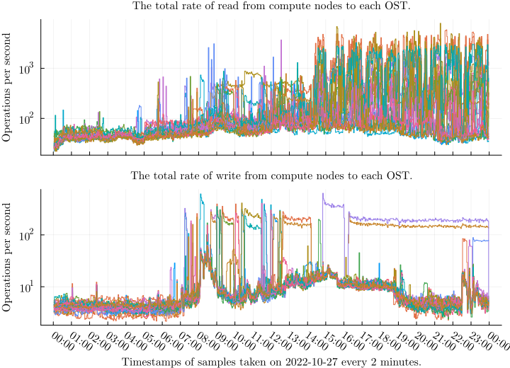

\clearpage

# Results
This section presents the results from analyzing the data obtained from monitoring file system usage on the Puhti cluster.
Unfortunately, due to issues with data quality from Lustre Jobstats on Puhti, we did not reach all the thesis goals set in Section \ref{introduction}.
We could not perform a reliable analysis of the monitoring data from the initial monitoring client and had to discard it.
Furthermore, the data quality issue prevented us from developing a reliable, automated analysis and visualization of the real-time monitoring data.
Also, we could not correlate file system usage with slowdowns because we were not able to gather enough reliable data after having to discard the initial data.
In Subsection \ref{entries-and-issues}, we discuss issues related to entry identifiers and investigate the entry identifiers from a large sample of consecutive Jobstats outputs.

Later, we obtained new data from the modified monitoring client.
However, due to the nature of the issue, we had to discard some of the obtained data.
The remaining data seems plausible.
We use this data to derive insights for future work.
Regarding the research questions from Section \ref{introduction}, the data indicates that we can identify users who perform more file system operations than others on the cluster, often orders of magnitude more.
However, the data quality issues reduce the reliability of the identification.

As a demonstration, we present different aspects of data from compute nodes taken at 2-minute intervals for 24 hours on 2022-10-27.
We omitted data from login and utility nodes in this analysis due to a lack of time to verify the correctness of the data.
Subsection \ref{counters-and-rates} shows raw counter values and computed rates of three jobs to illustrate different I/O patterns.
In Subsections \ref{total-rates-for-mdts} and \ref{total-rates-for-osts}, we show the total rates of each operation for each Lustre target to visualize larger-scale I/O patterns across the whole data set.
Finally, Subsection \ref{components-of-total-rates} shows how fine-grained measurements allow us to break the total rate down into its components.
Then we demonstrate how a single user can perform the majority of a total load of a given file system operation.

## Entries and issues

Format | Observed entry identifier
-|-
Correct | `wget.11317854`
Correct | `11317854:17627127:r01c01`
Missing job ID | `:17627127:r01c01`
Malformed | `wget`
Malformed | `wget.`
Malformed | `11317854`
Malformed | `11317854:`
Malformed | `113178544`
Malformed | `11317854:17627127`
Malformed | `11317854:17627127:`
Malformed | `11317854:17627127:r01c01.bullx`
Malformed | `:17627127:r01c01.bullx`
Malformed | `:1317854:17627127:r01c01`

: \label{tab:jobid-examples}
Examples of various observed entry identifiers.
The examples show correct entry identifiers, identifiers with missing job IDs, and various malformed identifiers.

We found that some of the observed entry identifiers did not conform to the format on the settings described in Section \ref{entry-identifier-format}.
Table \ref{tab:jobid-examples} demonstrates correct entry identifiers, an entry identifier with missing job ID, and different malformed entry identifiers we observed.

The first issue is missing job ID values.
Slurm sets a Slurm job ID for all non-system users running jobs on compute nodes, and the identifier should include it.
However, we found many entries from non-system users on compute nodes without a job ID.
Due to these issues, data from the same job might scatter into multiple time series without reliable indicators making it impossible to provide reliable statistics for specific jobs.
The issue might be related to problems fetching the environment variable's value.
This issue occurred in both MDSs and OSSs on Puhti.

The second, more serious issue is that there were malformed entry identifiers.
The issue is likely related to the lack of thread safety in the functions that produce the entry identifier strings in the Lustre Jobstats code.
A recent bug report mentioned broken entry identifiers [@jobid-atomic], which looked similar to our problems.
Consequently, we cannot reliably parse information from these entry identifiers, and we had to discard them, which resulted in data loss.
This issue occurred only in OSSs on Puhti.
We obtained feasible values for correct entry identifiers, but we are still determining if the integrity of the counter values is affected by this issue.

<!-- TODO: lines that do not show are zero -->

Next, we look at Figures \ref{fig:entry-ids-mds} and \ref{fig:entry-ids-oss}, which show the number of entries per Lustre target and identifier format for system and non-system users in a sample of 113 Jobstats outputs taken every 2-minutes from 2022-03-04.
For non-system users, we see that the number of entry identifiers with missing job IDs is substantial compared to the number of correct identifiers.
We also observe that Jobstats systemically generates malformed identifiers on the OSSs.
In some conditions, it can create many of them.
Entries from non-system users are the most valuable ones for analysis.

We also see many values generated by only two system users, root and job control.
Entries from system users usually did not have a job ID as their processes do not run via Slurm, although sometimes they do have a job ID.
We found that they usually contain little valuable information; for example, many have a single `statfs` operation.
Regarding data accumulation, each entry corresponds to one row in the database.
Therefore, reducing the number of entries reduces storage size and speeds up queries and the analysis.
We should discard or aggregate statistics of system users to reduce the accumulation of unnecessary data.
In general, correct entry identifiers would reduce unnecessary data accumulation.

\definecolor{non-system-user}{rgb}{0.1216,0.4667,0.7059}
\definecolor{system-user}{rgb}{1.0,0.498,0.0549}

\newpage

![
*We can see many missing job IDs compared to intact ones for non-system users, many entries for system users, and an unbalanced load between MDTs.*
The number of entries for each of the four MDTs during a sample of 113 Jobstats outputs taken every 2 minutes from 2022-03-04.
Each subplot shows a different identifier format; line color indicates \textcolor{non-system-user}{non-system users} and \textcolor{system-user}{system users}; and each line shows a different MDT for a given user type.
The first subplot shows the number of correct entries for login and utility nodes, and the second subplot shows them for compute nodes.
The third subplot shows the number of missing job IDs on compute nodes, which is substantial compared to the correct identifiers in the second subplot.
There are no malformed entries on MDTs.
We can see that only two of the four MDTs handle almost all of the metadata operations.
Of the two active MDTs, the first one seems to handle more operations than the second one, but their magnitudes seem to correlate.
\label{fig:entry-ids-mds}
](figures/entry_ids_mds.svg)

TODO: why do MDT loads seem unbalanced?

\newpage

![
*We can see many missing job IDs compared to intact ones for non-system users, many entries for system users, systematic generation of malformed entry identifiers, and a balanced load between OSTs.*
The number of entries for each of the 24 OSTs during a sample of 113 Jobstats outputs taken every 2 minutes from 2022-03-04.
Each subplot shows a different identifier format; line color indicates \textcolor{non-system-user}{non-system users} and \textcolor{system-user}{system users}; and each line shows a different OST for a given user type.
The first subplot shows the number of correct entries for login and utility nodes, and the second subplot shows them for compute nodes.
The third subplot shows the number of missing job IDs on compute nodes, which is substantial compared to the correct identifiers in the second subplot.
The fourth subplot shows the number of malformed identifiers for all nodes.
We can see that Jobstats on Puhti systematically produce missing job IDs and malformed identifiers.
Furthermore, there is a large burst of malformed identifiers from 12.06 to 12.26, which indicates in some conditions, Jobstats produces a huge amount of malformed identifiers.
It might be due to a heavy load on the OSS.
\label{fig:entry-ids-oss}
](figures/entry_ids_oss.svg)

\clearpage

## Counters and rates
<!-- TODO: demonstrates the fine-grained nature of data -->
Figures \ref{fig:job-rate-1}, \ref{fig:job-rate-2}, and \ref{fig:job-rate-3} show different patterns of counter values and rates for write operations for different jobs during a 24-hour period of 2022-10-27.
They demonstrate the values of the counter collected from the statistics, rates computed from the counters, and entry resets, discussed in Section \ref{monitoring-and-analysis}.
The x-axis displays time, and the y-axis displays the accumulated amount of operations for counters and the operations per second for the rate.
Each line displays a *connection* from one Lustre client to one Lustre Target.
All figures display a single node job; thus, each connection shows write operations from the same to a different OST.
We say that a connection is *active* during a period that performs any file system operations, and otherwise, it is *inactive*.

![
The first subplot shows the counter values, and the second subplot shows the rates computed from the counter values in the first plot.
The counter values follow a typical saw-tooth pattern for almost linearly increasing counter values that reset periodically due to inactivity.
In the active periods, we see a higher write amount of writes in the beginning, then quite near constant write rate until the job becomes inactive.
The lines follow a similar pattern indicating that the job performs a similar write pattern for each OST except for the ones whose rate is near zero.
\label{fig:job-rate-1}
](figures/2022-10-27_ost_job_write_1.svg)

![
The first subplot shows the counter values, and the second subplot shows the rates computed from the counter values in the first plot.
One of the counter values increases in a wave-like pattern that resets periodically; the other counter seems to increase in a burst-like manner for short periods of time before resetting.
By looking at the rates, we can see that the rates fluctuate for all OSTs.
Furthermore, most of the time, the job performs writes to one OST and sometimes to multiple OSTs in a burst.
\label{fig:job-rate-3}
](figures/2022-10-27_ost_job_write_3.svg)

\clearpage

## Total rates for MDTs
Figures \ref{fig:total-mdt-1}, \ref{fig:total-mdt-2} and \ref{fig:total-mdt-3} show the total rates of all operations from compute nodes to each of four MDTs during 24 hours of 2022-10-27.
We use a logarithmic scale due to large variations in the magnitude of the rates.
<!-- The MDT figures show that only one or two of four MDTs are usually actively handling operations. -->

\clearpage

## Total rates for OSTs
Figures \ref{fig:total-ost-1} and \ref{fig:total-ost-2} show the total rates of all operations from compute nodes to each of 24 OSTs during 24 hours of 2022-10-27.
We use a logarithmic scale due to large variations in the magnitude of the rates.
The interesting features in the figures are the variation of rates across time and between targets.
For example, significant differences between the rates of two OSTs indicate an unbalanced load.
A problematic I/O pattern or insufficient file striping might cause the imbalance.
File striping means Lustre segments the file data into multiple OSTs instead of storing all the data in a single OST.

\clearpage

## Components of total rates
![This graph shows read operations on OST0001 during 24 hours of 2022-10-27.
The first subplot shows the time series of the total rate, the second subplot shows the time series of the total rate of each user ID, and the third subplot shows the density of the total rates of each user ID.
We can see that individual users cause spikes in the read rates.
A heatmap consists of time in the x-axis, discrete bins in the y-axis, and color in the z-axis, indicating how many time series have the value at the bin's range at that time.
\label{fig:density}](figures/2022-10-27_ost0001_compute_read.svg)

We can use a density plot to visually extract meaningful information from large numbers of time series.
We also use a logarithmic scale for the density due to the large variations.
As shown in Figure \ref{fig:density}, obtaining information from a graph with many time series is challenging as they tend to overlap apart from the individual spikes.
The base load mostly stays the same, although a few more users perform read operations from around 7.00 to 17.00 UTC, corresponding to daytime in Finland (10.00 to 20.00).
We can perform a similar analysis based on job ID or node name.

The density is a statistical plot that shows how many time series has a value in a specific range at a particular time. 
However, it omits information about individual time series.
It lets us distinguish whether a small number of users perform a large magnitude of operations or a large number of users perform a small magnitude of operations.
We can also use it to obtain information such as time intervals and value ranges to filter the data further.
An important question is whether we could obtain such information automatically.

