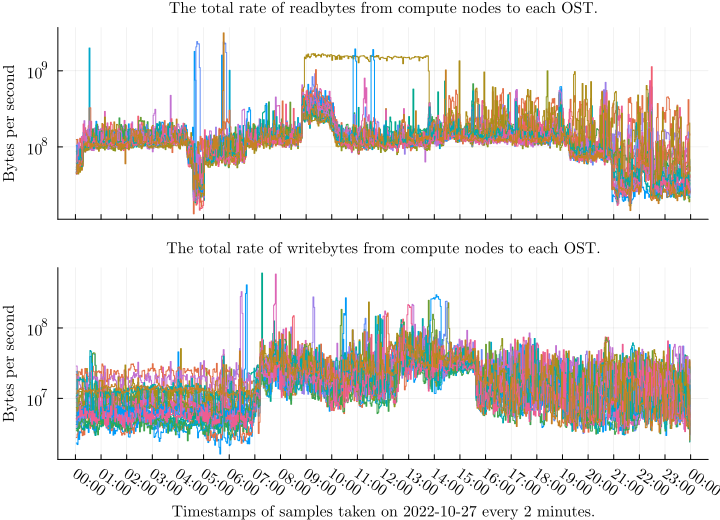

## Counters and rates
This section shows examples of the sampled counter values and rates computed from the counters.
We refer to operations from a Lustre client (node) to a Lustre target as a *connection*.
Figures \ref{fig:job-rate-1}, \ref{fig:job-rate-2}, and \ref{fig:job-rate-3} show different patterns of counter values and the computed rates for write operations for 24 hour-period of 2022-10-27. 
Each line displays the values for a connection from a compute node to an OST for the same job.
The x-axis displays time, and the y-axis displays the accumulated amount of operations for counters and the operations per second for the rate.

\clearpage

## Total rates
This section shows the total rates from all compute nodes to each target for each measured operation, listed in Table \ref{tab:operations}.
We show the total rates during 24 hours of 2022-10-27 for MDTs in Figures \ref{fig:total-mdt-1}, \ref{fig:total-mdt-2} and \ref{fig:total-mdt-3}, and for OSTs in Figures \ref{fig:total-ost-1} and \ref{fig:total-ost-2}.
The MDT figures show that only one or two of four MDTs are usually actively handling operations.
On the contrary, all 24 OSTs handle operations.
The interesting features in the figures are the variation of rates across time and between targets.
For example, significant differences between the rates of two OSTs indicate that the load is not balanced.
A problematic I/O pattern or insufficient file striping might cause the imbalance.
File striping means Lustre segments the file data into multiple OSTs instead of storing all the data in a single OST.
Please note that we use a logarithmic scale due to large variations in the magnitude of the rates.

\clearpage

## Density
We can use the density of logarithmic values to visually extract meaningful information from large numbers of time series by plotting them as a heatmap.
A heatmap consists of time in the x-axis, discrete bins in the y-axis, and color in the z-axis, indicating how many time series have the value at the bin's range at that time.

![The upper subplot shows the total rate of read operations on OST0001 during 24 hours of 2022-10-27.
The middle subplot shows the total rate of each user.
Apart from the individual spikes, it is difficult to obtain information from the graph as many time series overlap.
The lower subplot shows the density of the total rates of each user.
It shows us how many users perform different rates of read operations during each interval, although there is no information about individual time series anymore.
\label{fig:density}](figures/2022-10-27_ost0001_compute_read.svg)

Density plot can show us whether changes in total rate consist of few time series with large magnitude or lots of time series with smaller magnitude.
We can obtain information for improved queries to the data.
Obtain filtering conditions for time interval and magnitude of rates, could we find these automatically?