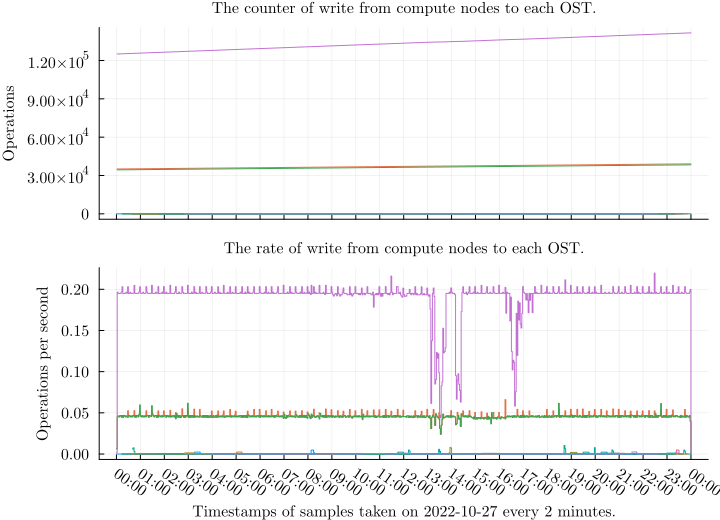

## Counters and rates of a job
Counters and rates of an individual job from computes nodes to OSTs.

\clearpage

## Total rates of all targets per operation

\clearpage

## Total rate and densities of aggregates per target

